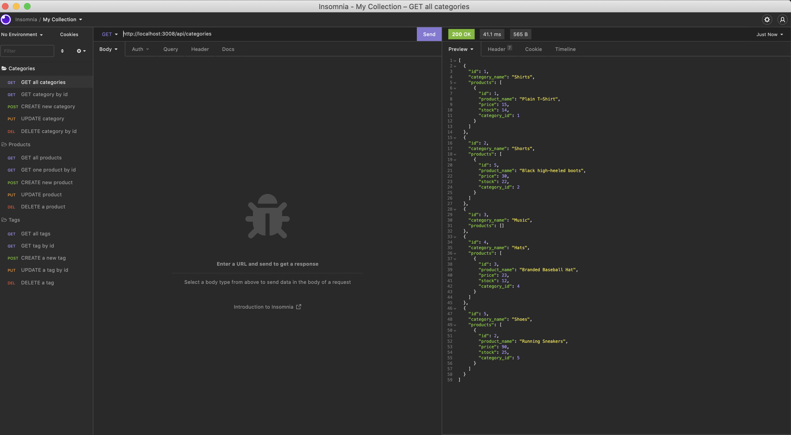
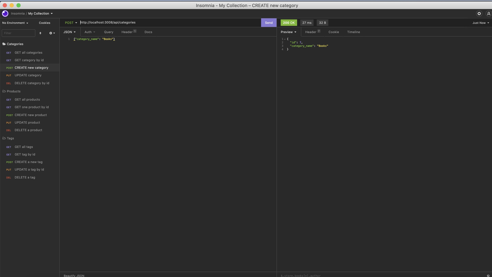

# E-commerce Backend

## Table of Contents

- <a href="#description">Project Description</a>
- <a href="#technologies">Technologies</a>
- <a href="#installation"> Installation </a>
- <a href="#demonstration">Demonstration </a>
- <a href="#link">Link </a>
- <a href="#contact">Contact</a>

 

## Description
The project is a backend for an e-commerce site, built by modifying starter code. It required the configuration of an Express.js API to use Sequelize to interact with a MySQL database.

 

## Technologies

This application was built with:
* Node.js
* Express.js
* Sequelize
* MySQL2
* Javascript

It also uses 'dotenv' to prevent sharing of user passwords.

 

## Installation

To use this application, the user will need to clone the repository to their machine, then install all dependencies. The user must also set up a .env file, to hold their database name, username and password.

The application can be started from the command line, using the command 'npm start'

 

## Demonstration

To view a video demonstration of the application's functionality click <a href="https://watch.screencastify.com/v/p3JUKZR0AFTlyMrLDCRg"> here </a>

 

## Link

The project repository can be accessed at <a href="https://github.com/ekubik/ecommerce-backend">https://github.com/ekubik/ecommerce-backend</a>

 

## Contact

Contact Ewa at <a href="mailto:ewa.kubik@hotmail.com"> ewa.kubik@hotmail.com </a>

## Additional Comments:
Please note that despite the fact that an error appears when trying to update a product, the product details are updated, and new data is saved 